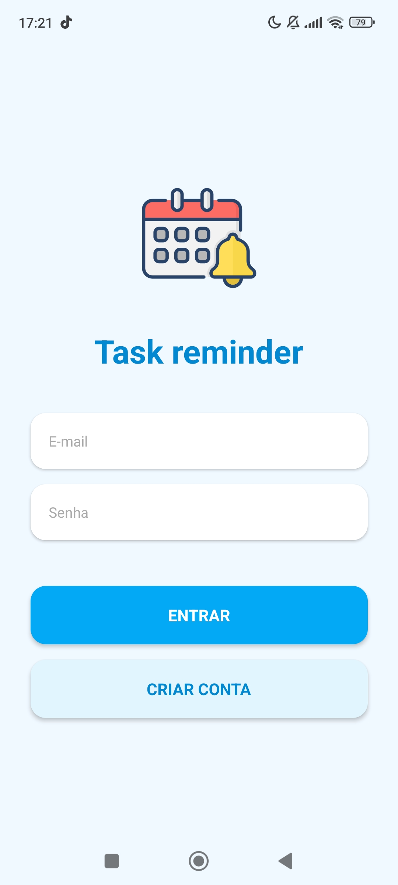
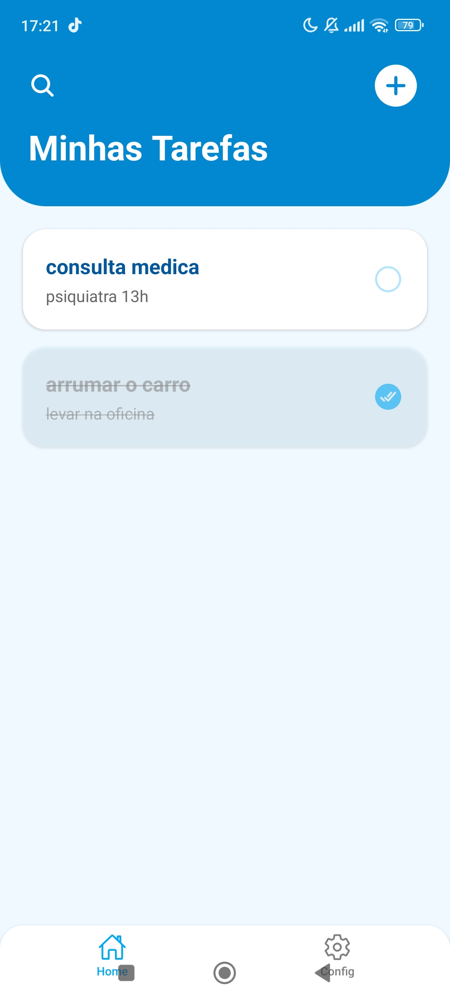
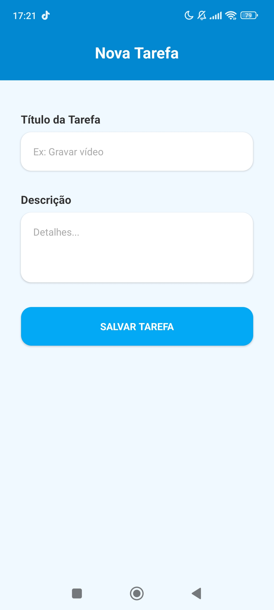
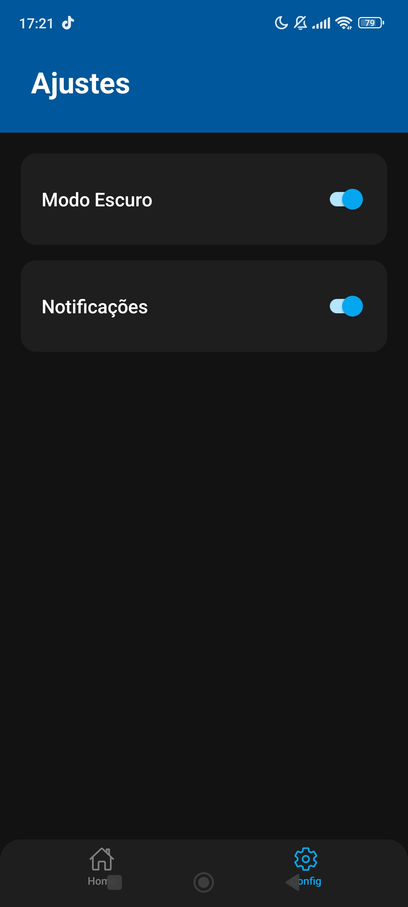

# App Lembretes (Task reminder)

Aplicativo móvel desenvolvido em React Native (Expo) para a disciplina de Desenvolvimento para Dispositivos Móveis. O projeto permite organizar tarefas diárias com uma interface limpa em tons de azul e conta com funcionalidade de Modo Escuro.

##  Membro do Grupo 

* Grazielly Cristine Mendes Figueiredo: Estrutura do projeto, navegação, Tela de Login, Tela de Configurações, Modo Escuro e estilização Flexbox.

##  Requisitos Atendidos
* Componentes base: `View`, `Text`, `TextInput`, `TouchableOpacity`, `FlatList` e `Image`.
* Layout com Flexbox.
* Navegação em pilha (Stack) e abas (Tabs).
* 5 Telas funcionais.

## Instalação

1. Clone este repositório:
   `git clone https://github.com/grazi888/applembrete_novo.git`
2. Acesse a pasta do projeto:
   `cd app-tarefas`
3. Instale as dependências:
   `npm install`
4. Inicie o app:
   `npx expo start`
5. Leia o QR Code com o app **Expo Go** no seu celular.

## Prints do Aplicativo

  
  
  
  

